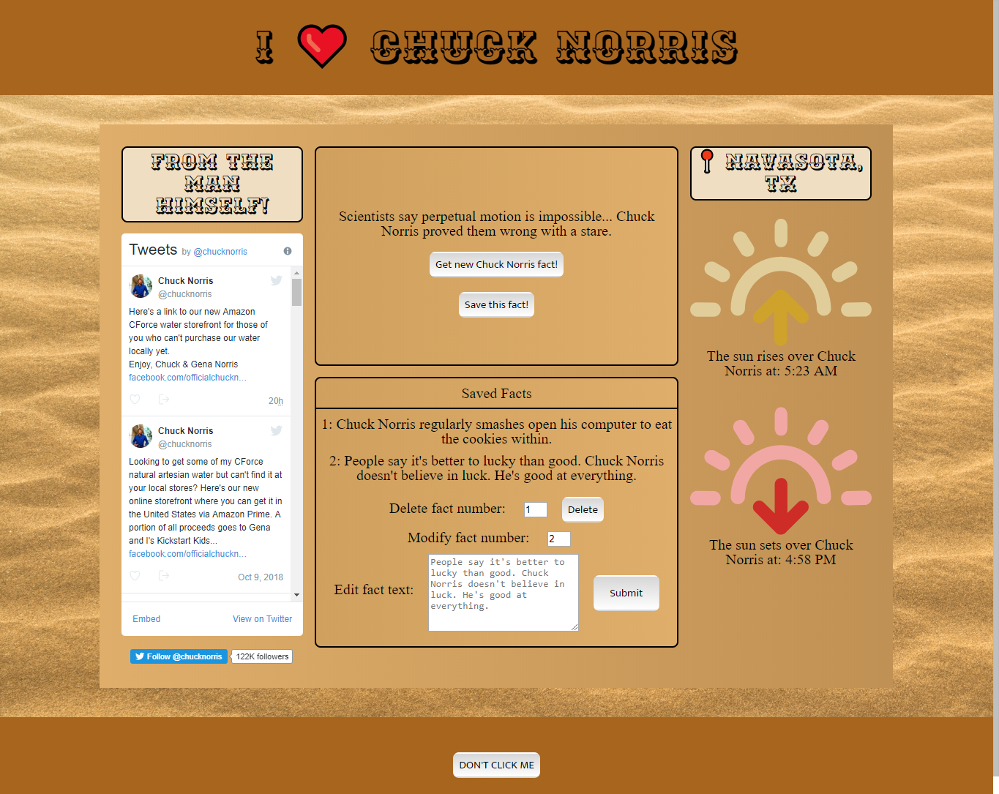

## Chuck Norris Joke Generator is a project by web developer Michael Kerr

#### This app is intended to display a sound understanding of RESTful API's and the React framework.

***

### Technologies showcased in the code of the project:
- React
- Node
- Express
- RESTful API's
- CSS

### Main View

After fetching a (usually terrible) random Chuck Norris joke from a third-party API, the user is able to save them to a list. Once the joke is part of the personal list, the user can update or delete the information from the front end and send the changes to the backend using internal API calls.

The app also integrates Chuck Norris' Twitter feed and uses a weather API to get the sunrise and sunset over Chuck Norris' home town.

The *Don't Click Me* button offers users a chance of instant death by toggling a gigantic picture of Chuck Norris staring into the camera.

